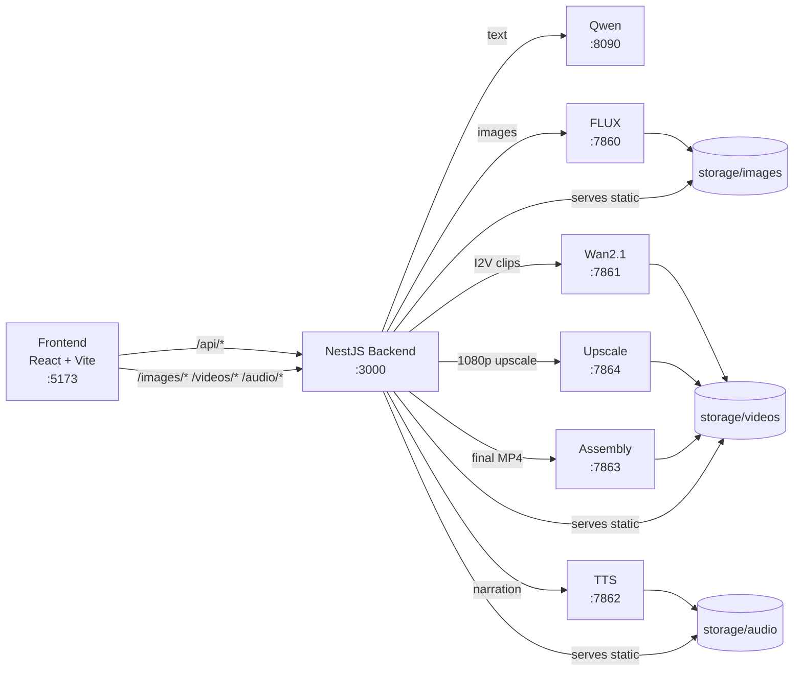

# AI Story Factory

AI Story Factory turns a short topic into a finished short video: idea, narrative, script, character profile, scene images, scene clips upscaled to 1080p, narration audio, and a final assembled MP4 with burned-in subtitles. Text generation runs through a local **Qwen3-14B Q4_K_M** (GGUF) service; images through **FLUX**; local scene video through **Wan2.1 I2V**; upscaling, TTS, and final assembly through lightweight Python/ffmpeg services. Each pipeline step pauses for your review — approve to continue or regenerate until satisfied.

## Features

| Feature | Description |
|---------|-------------|
| **9-step pipeline** | Idea → story → script → character → prompts → images → scene videos (1080p) → audio → assembly → complete |
| **Review gates** | Approve or regenerate each step (and individual scenes) before continuing |
| **Story language** | English or Hindi (`storyLanguage: en \| hi`). Narration and script use the chosen language; image/video prompts stay English for model compatibility |
| **Video generation mode** | **Local** — Wan2.1 I2V per scene, then auto-upscale to 1080p. **Professional** — upload clips from external tools (Kling, Veo, Runway, etc.), then auto-upscale |
| **Async generation jobs** | Image and video steps return a `jobId` immediately; the UI polls until each scene completes (avoids proxy timeouts on long FLUX/Wan runs) |
| **Project persistence** | Save/resume pipeline progress as JSON under `storage/projects/` |
| **Long-running timeouts** | FLUX and Wan requests default to 48 h; Vite and NestJS proxy timeouts match |

## Project structure

```
ai-story-factory/
└── apps/
    ├── backend/          NestJS API, LangGraph agents, service integrations
    │   ├── src/
    │   │   ├── agents/   Idea, story, script, character, prompt, image, video, upscale, audio, assembly
    │   │   ├── graphs/   LangGraph content pipeline (idea → story → script)
    │   │   └── services/ Qwen, FLUX, Wan, upscale, TTS, assembly, image/video job queues
    │   ├── qwen-service/     Python FastAPI — Qwen3-14B text generation (:8090)
    │   ├── flux-service/     Python FastAPI — FLUX image generation (:7860)
    │   ├── hunyuan-service/  Python FastAPI — Wan2.1 I2V (:7861)
    │   ├── tts-service/      Python FastAPI — narration TTS (:7862)
    │   ├── assembly-service/ Python FastAPI — ffmpeg final video (:7863)
    │   ├── upscale-service/  Python FastAPI — scene upscale to 1080p (:7864)
    │   └── storage/          Generated media and projects (gitignored except .gitkeep)
    └── frontend/         React + Vite UI (:5173)
```

Compiled NestJS output (`apps/backend/dist/`) is **gitignored** — run `npm run build` locally; do not commit build artifacts.

## Architecture



### Content pipeline

The UI runs these steps in order. **Each step pauses for review** — approve the output or regenerate before continuing:

| Step | Agent / action | Output |
|------|----------------|--------|
| 1. Idea | `IdeaAgent` | Viral short-video concept from a topic |
| 2. Story | `StoryAgent` | Full narrative from the idea |
| 3. Script | `ScriptAgent` | Scene-by-scene script (narration, visuals, duration) |
| 4. Character | `CharacterAgent` | Consistent character appearance description |
| 5. Video prompts | `PromptAgent` | FLUX/Wan-ready prompt per scene (regenerate per scene) |
| 6. Images | `ImageAgent` | PNG per scene via FLUX (async job, regenerate per scene) |
| 7. Scene videos (1080p) | `VideoAgent` + `UpscaleAgent` (local) or upload + upscale (professional) | 1080p MP4 per scene |
| 8. Audio | `AudioAgent` | Narration WAV per scene via TTS (Edge TTS for Hindi) |
| 9. Assembly | `AssemblyAgent` | Final story video with synced audio and subtitles |

A LangGraph workflow (`content.graph.ts`) also chains **idea → story → script** for programmatic use.

### Story language (English / Hindi)

- Set **Story language** on the project form before starting.
- Idea, story, script, narration, and TTS output use the selected language.
- Hindi narration uses Edge TTS voice `hi-IN-SwaraNeural` (configurable via `TTS_EDGE_VOICE_HI`).
- Image and video prompts remain in English so FLUX and Wan receive compatible input.

### Video generation mode

| Mode | Flow |
|------|------|
| **Local** | Wan2.1 generates a 480p clip from each scene image, then the upscale service converts it to 1080p. Original 480p files are removed after upscale. |
| **Professional** | Generate clips externally using the exported prompts, upload each scene MP4 in the UI, then auto-upscale to 1080p. |

## Prerequisites

| Tool | Version | Used by |
|------|---------|---------|
| [Node.js](https://nodejs.org/) | 20+ recommended | Backend and frontend |
| [Python](https://www.python.org/) | 3.10+ | Qwen, FLUX, Wan, TTS, assembly, upscale services |
| [npm](https://www.npmjs.com/) | 10+ | Package installs |
| NVIDIA GPU + driver | Optional but strongly recommended | Qwen, FLUX, and Wan inference |
| [Hugging Face account](https://huggingface.co/) | — | Model download |

**GPU notes**

- **Qwen3-14B Q4_K_M** (GGUF) uses roughly **9 GB** VRAM when fully offloaded to GPU (`QWEN_N_GPU_LAYERS=-1`).
- **FLUX.1-dev** needs roughly **24 GB VRAM** if the full model is loaded on GPU; use `FLUX_OFFLOAD_MODE=sequential` on 12 GB cards.
- **Wan2.1-I2V-14B-480P** needs **12–14 GB VRAM** with model CPU offloading and VAE tiling on a 4070; stop FLUX before video generation.
- **TTS, upscale, and assembly** run on CPU via ffmpeg — no GPU required.
- **12 GB GPUs (e.g. RTX 4070):** run pipeline phases sequentially — text → images → videos. **Stop FLUX before starting the video service.** See `apps/backend/.env.example` for a full 4070 profile.
- Install **CUDA-enabled PyTorch**, not the CPU-only wheel from plain `pip install torch`.

## Local setup

Run all commands from the repository root unless noted otherwise.

### 1. Clone the repository

```bash
git clone <repository-url>
cd ai-story-factory
```

### 2. Backend (NestJS)

```bash
cd apps/backend
npm install
```

Create environment file:

```bash
cp .env.example .env
```

Edit `apps/backend/.env`:

```env
FRONTEND_URL=http://localhost:5173
QWEN_SERVICE_URL=http://127.0.0.1:8090
FLUX_SERVICE_URL=http://127.0.0.1:7860
HUNYUAN_SERVICE_URL=http://127.0.0.1:7861
TTS_SERVICE_URL=http://127.0.0.1:7862
ASSEMBLY_SERVICE_URL=http://127.0.0.1:7863
UPSCALE_SERVICE_URL=http://127.0.0.1:7864
# Optional. Defaults under apps/backend/storage/
IMAGE_STORAGE_DIR=
VIDEO_STORAGE_DIR=
AUDIO_STORAGE_DIR=
PROJECT_STORAGE_DIR=
PORT=3000
# Optional. FLUX/Wan default to 48 h for slow GPUs.
FLUX_BODY_TIMEOUT_MS=
HUNYUAN_BODY_TIMEOUT_MS=
```

Start the API:

```bash
npm run start:dev
```

Backend runs at **http://localhost:3000**.

Other scripts:

```bash
npm run build        # Compile TypeScript → apps/backend/dist/ (gitignored)
npm run start:prod   # Run compiled app
npm test             # Unit tests
npm run test:e2e     # End-to-end tests
```

### 3. Qwen text service (Python)

Required before generating text (idea through video prompts).

```bash
cd apps/backend/qwen-service
python -m venv .venv
```

**Windows (PowerShell)**

```powershell
.\.venv\Scripts\Activate.ps1
```

**macOS / Linux**

```bash
source .venv/bin/activate
```

Install llama-cpp-python with CUDA (NVIDIA GPU):

```bash
pip install llama-cpp-python --extra-index-url https://abetlen.github.io/llama-cpp-python/whl/cu124
```

CPU-only fallback:

```bash
pip install llama-cpp-python
```

Install remaining dependencies:

```bash
pip install -r requirements.txt
python server.py
```

Service runs at **http://127.0.0.1:8090**. First startup downloads [qwen3-14b-q4_k_m.gguf](https://huggingface.co/Aldaris/Qwen3-14B-Q4_K_M-GGUF) (~9 GB).

From the backend folder: `npm run qwen:dev`

#### Qwen environment variables

| Variable | Default | Description |
|----------|---------|-------------|
| `QWEN_MODEL_REPO` | `Aldaris/Qwen3-14B-Q4_K_M-GGUF` | Hugging Face repo |
| `QWEN_MODEL_FILE` | `qwen3-14b-q4_k_m.gguf` | GGUF filename |
| `QWEN_PORT` | `8090` | Bind port |
| `QWEN_N_GPU_LAYERS` | `-1` | GPU layers (`-1` = all; `0` = CPU only) |
| `QWEN_CONTEXT_SIZE` | `8192` | Context window |
| `QWEN_MAX_NEW_TOKENS` | `2048` | Max tokens per generation |

### 4. FLUX image service (Python)

Required before generating images.

```bash
cd apps/backend/flux-service
python -m venv .venv
# activate venv (see above)
pip install torch --index-url https://download.pytorch.org/whl/cu130
pip install -r requirements.txt
huggingface-cli login   # accept FLUX license first
python server.py
```

Service runs at **http://127.0.0.1:7860**.

| Variable | Default | Description |
|----------|---------|-------------|
| `FLUX_MODEL_ID` | `black-forest-labs/FLUX.1-dev` | Hugging Face model id |
| `FLUX_PORT` | `7860` | Bind port |
| `FLUX_IMAGE_WIDTH` | `832` | Output width (matches Wan 480P) |
| `FLUX_IMAGE_HEIGHT` | `480` | Output height |
| `FLUX_OFFLOAD_MODE` | `sequential` | `sequential`, `model`, or `full` |

From the backend folder: `npm run flux:dev`

### 5. Wan2.1 service (Python)

Required for **local** video mode. Uses each scene FLUX image as the first frame (832×480).

```bash
cd apps/backend/hunyuan-service
python -m venv .venv
# activate venv
pip install torch --index-url https://download.pytorch.org/whl/cu130
pip install -r requirements.txt
python server.py
```

Service runs at **http://127.0.0.1:7861**.

| Variable | Default | Description |
|----------|---------|-------------|
| `HUNYUAN_MODEL_ID` | `Wan-AI/Wan2.1-I2V-14B-480P-Diffusers` | Hugging Face model id |
| `HUNYUAN_PORT` | `7861` | Bind port |
| `HUNYUAN_OFFLOAD_MODE` | `auto` | `auto`, `model`, `sequential`, or `full` |
| `HUNYUAN_VIDEO_WIDTH` | `832` | Must match FLUX output |
| `HUNYUAN_VIDEO_HEIGHT` | `480` | Must match FLUX output |

From the backend folder: `npm run hunyuan:dev`

**Tip:** Stop FLUX before starting Wan2.1 on 12 GB GPUs.

### 6. TTS service (Python)

Required before the audio step. Uses Kokoro locally when available; falls back to Edge TTS (including Hindi).

```bash
cd apps/backend/tts-service
python -m venv .venv
# activate venv
pip install -r requirements.txt
python server.py
```

Service runs at **http://127.0.0.1:7862**.

| Variable | Default | Description |
|----------|---------|-------------|
| `TTS_PORT` | `7862` | Bind port |
| `TTS_BACKEND` | `auto` | `auto`, `kokoro`, or `edge` |
| `TTS_EDGE_VOICE` | `en-US-AriaNeural` | English Edge TTS voice |
| `TTS_EDGE_VOICE_HI` | `hi-IN-SwaraNeural` | Hindi Edge TTS voice |

From the backend folder: `npm run tts:dev`

### 7. Upscale service (Python)

Upscales scene clips to 1080p (ffmpeg). Runs after each scene video is generated or uploaded.

```bash
cd apps/backend/upscale-service
python -m venv .venv
# activate venv
pip install -r requirements.txt
python server.py
```

Service runs at **http://127.0.0.1:7864**.

| Variable | Default | Description |
|----------|---------|-------------|
| `UPSCALE_PORT` | `7864` | Bind port |
| `UPSCALE_TARGET_WIDTH` | `1920` | Output width |
| `UPSCALE_TARGET_HEIGHT` | `1080` | Output height |

From the backend folder: `npm run upscale:dev`

### 8. Assembly service (Python)

Joins upscaled scene clips, syncs narration, and burns in subtitles.

```bash
cd apps/backend/assembly-service
python -m venv .venv
# activate venv
pip install -r requirements.txt
python server.py
```

Service runs at **http://127.0.0.1:7863**.

| Variable | Default | Description |
|----------|---------|-------------|
| `ASSEMBLY_PORT` | `7863` | Bind port |
| `ASSEMBLY_SUBTITLES` | `true` | Burn narration as subtitles |
| `ASSEMBLY_SUBTITLE_FONT_SIZE` | `22` | Subtitle font size |

From the backend folder: `npm run assembly:dev`

### 9. Frontend (React + Vite)

```bash
cd apps/frontend
npm install
npm run dev
```

Frontend runs at **http://localhost:5173**.

Vite proxies (48 h timeout for long generation):

- `/api/*` → `http://localhost:3000/*`
- `/images/*` → `http://localhost:3000/images/*`
- `/videos/*` → `http://localhost:3000/videos/*`
- `/audio/*` → `http://localhost:3000/audio/*`

Build for production:

```bash
npm run build
npm run preview
```

## Running everything locally

Open **eight terminals** for a full local pipeline (GPU phases can share fewer terminals if you stop services between phases):

| Terminal | Directory | Command | When needed |
|----------|-----------|---------|-------------|
| 1 | `apps/backend/qwen-service` | `python server.py` | Text steps |
| 2 | `apps/backend/flux-service` | `python server.py` | Image step |
| 3 | `apps/backend/hunyuan-service` | `python server.py` | Local video step |
| 4 | `apps/backend/upscale-service` | `python server.py` | Video step (local or professional) |
| 5 | `apps/backend/tts-service` | `python server.py` | Audio step |
| 6 | `apps/backend/assembly-service` | `python server.py` | Assembly step |
| 7 | `apps/backend` | `npm run start:dev` | Always |
| 8 | `apps/frontend` | `npm run dev` | Always |

Then open **http://localhost:5173**, pick story language and video mode, enter a topic, and run the pipeline.

**Recommended GPU workflow on 12 GB VRAM:** Qwen + FLUX for text/images → stop FLUX → Wan for videos → start upscale/TTS/assembly (CPU) for the rest.

## API reference

Base URL: `http://localhost:3000`

### Text and content

| Method | Path | Body | Response |
|--------|------|------|----------|
| `POST` | `/generate/idea` | `{ "topic", "storyLanguage"? }` | `{ "idea" }` |
| `POST` | `/generate/story` | `{ "idea", "storyLanguage"? }` | `{ "story" }` |
| `POST` | `/generate/script` | `{ "story", "storyLanguage"? }` | `{ "script": SceneScript[] }` |
| `POST` | `/generate/character/profile` | `{ "story", "script", "storyLanguage"? }` | `{ "characterAppearance" }` |
| `POST` | `/generate/prompt` | `{ "scene", "characterAppearance", "videoMode"?, "storyLanguage"? }` | `{ "scene" }` |

`storyLanguage`: `"en"` (default) or `"hi"`. `videoMode`: `"local"` (default) or `"professional"`.

### Images and videos (async jobs)

| Method | Path | Body | Response |
|--------|------|------|----------|
| `POST` | `/generate/image` | `{ "scene" }` | `{ "jobId", "status", "sceneNumber" }` |
| `GET` | `/generate/image/:jobId` | — | Job status; `scene` when `completed` |
| `POST` | `/generate/video` | `{ "scene" }` | `{ "jobId", "status", "sceneNumber" }` |
| `GET` | `/generate/video/:jobId` | — | Job status; `scene` when `completed` |
| `POST` | `/upload/video` | `multipart: file`, `scene_number` | `{ "videoPath", ... }` |
| `POST` | `/generate/upscale` | `{ "scene" }` | `{ "scene" }` with `upscaledVideoPath` |

Poll image/video jobs from the UI until `status` is `completed` or `failed`.

### Audio, assembly, and static media

| Method | Path | Body | Response |
|--------|------|------|----------|
| `POST` | `/generate/audio` | `{ "scene", "storyLanguage"? }` | `{ "scene" }` with `audioPath` |
| `POST` | `/generate/assembly` | `{ "scenes", "projectName"? }` | `{ "finalVideoPath" }` |
| `GET` | `/images/:filename` | — | PNG |
| `GET` | `/videos/:filename` | — | MP4 |
| `GET` | `/audio/:filename` | — | WAV |

### Projects

| Method | Path | Body | Response |
|--------|------|------|----------|
| `GET` | `/projects` | — | `ProjectSummary[]` |
| `POST` | `/projects` | `{ "name"?, "state"? }` | `Project` |
| `GET` | `/projects/:id` | — | `Project` |
| `PUT` | `/projects/:id` | `{ "name"?, "state"? }` | `Project` |
| `DELETE` | `/projects/:id` | — | `204 No Content` |

### SceneScript fields

`sceneNumber`, `narration`, `visualDescription`, `duration`, and optional:

- `videoPrompt`, `characterAppearance`, `imagePath`
- `videoPath` (480p source; removed after upscale)
- `upscaledVideoPath` (1080p clip used for assembly)
- `audioPath`

## Tech stack

| Layer | Technologies |
|-------|----------------|
| Frontend | React 19, TypeScript, Vite |
| Backend | NestJS 11, TypeScript |
| AI orchestration | LangGraph, LangChain |
| Text model | Qwen3-14B Q4_K_M GGUF (llama.cpp) |
| Image model | FLUX.1-dev (Diffusers) |
| Video model | Wan2.1-I2V-14B-480P (Diffusers) |
| Narration | Kokoro + Edge TTS |
| Post-production | ffmpeg (upscale + assembly) |
| Python services | FastAPI, Uvicorn, PyTorch, Diffusers |

## Troubleshooting

### `device=cpu` despite having an NVIDIA GPU

Plain `pip install torch` installs the **CPU-only** build. Reinstall with a CUDA index:

```bash
pip install torch --upgrade --index-url https://download.pytorch.org/whl/cu130
```

### `CUDA out of memory`

- FLUX: `FLUX_OFFLOAD_MODE=sequential`, lower resolution, or use FLUX.1-schnell
- Wan: stop FLUX and Qwen first; lower `HUNYUAN_INFERENCE_STEPS` or `HUNYUAN_MAX_NUM_FRAMES`
- Close other GPU-heavy apps

### Text / image / video generation fails from the UI

1. Confirm the relevant service health endpoint (`/health` on each Python service)
2. Confirm service URLs in `apps/backend/.env`
3. Check the service terminal for Python errors
4. For long runs, ensure NestJS was restarted after timeout env changes (`FLUX_BODY_TIMEOUT_MS`, `HUNYUAN_BODY_TIMEOUT_MS` default to 48 h)

### Proxy `ECONNRESET` or timeout during image generation

Image generation uses **async jobs** — the UI starts a job and polls status. If you still see proxy errors, confirm NestJS is running and Vite proxy timeouts are in place (`vite.config.ts`).

### CORS errors

Set `FRONTEND_URL` in `apps/backend/.env` to match where the UI is served (default `http://localhost:5173`).

## Storage

| Path | Contents |
|------|----------|
| `apps/backend/storage/images/` | Scene PNGs — served at `/images/<filename>` |
| `apps/backend/storage/videos/` | Scene and final MP4s — served at `/videos/<filename>` |
| `apps/backend/storage/audio/` | Narration WAVs — served at `/audio/<filename>` |
| `apps/backend/storage/projects/` | Saved project JSON (topic, all steps, review state) |

Media and project files are **gitignored**; only `.gitkeep` files are tracked.

## Git and build artifacts

Do **not** commit:

- `apps/backend/dist/` — NestJS compile output (`npm run build`)
- `apps/frontend/dist/` — Vite production build
- `apps/backend/storage/` — generated media and projects
- Python `__pycache__/` and `.venv/` directories

If `apps/backend/dist/` was previously tracked, remove it from the index (files stay on disk):

```bash
git rm -r --cached apps/backend/dist
```
