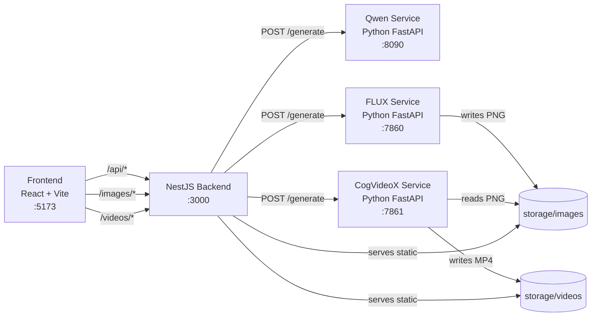

# AI Story Factory

AI Story Factory turns a short topic into a multi-scene short-video story pipeline: idea, narrative, script, character profile, video prompts, scene images, and scene videos. Text generation runs through a local **Qwen3-14B Q4_K_M** (GGUF) service; image generation runs through a local [FLUX](https://huggingface.co/black-forest-labs/FLUX.1-dev) service; video generation runs through a local [CogVideoX-5B-I2V](https://huggingface.co/THUDM/CogVideoX-5b-I2V) image-to-video service. Each pipeline step pauses for your review — approve to continue or regenerate until satisfied.

## Project structure

```
ai-story-factory/
└── apps/
    ├── backend/          NestJS API, LangGraph agents, Qwen + FLUX + CogVideoX integration
    │   ├── src/
    │   │   ├── agents/   Idea, story, script, character, prompt, image, video agents
    │   │   ├── graphs/   LangGraph content pipeline (idea → story → script)
    │   │   └── services/ Qwen, FLUX, and CogVideoX HTTP clients
    │   ├── qwen-service/ Python FastAPI service for Qwen3-14B Q4_K_M (GGUF) text generation
    │   ├── flux-service/ Python FastAPI service for FLUX image generation
    │   ├── hunyuan-service/ Python FastAPI service for CogVideoX I2V
    │   └── storage/      Generated images and videos (gitignored except .gitkeep)
    └── frontend/         React + Vite UI
```

## Architecture



### Content pipeline

The UI runs these steps in order. **Each step pauses for review** — you approve the output or regenerate before continuing:

| Step | Agent | Output |
|------|-------|--------|
| 1. Idea | `IdeaAgent` | A viral short-video concept from a topic |
| 2. Story | `StoryAgent` | Full narrative from the idea |
| 3. Script | `ScriptAgent` | Scene-by-scene script (narration, visuals, duration) |
| 4. Character | `CharacterAgent` | Consistent character appearance description |
| 5. Video prompts | `PromptAgent` | FLUX-ready prompt per scene (regenerate per scene) |
| 6. Images | `ImageAgent` | PNG image per scene via FLUX service (regenerate per scene) |
| 7. Videos | `VideoAgent` | MP4 clip per scene via CogVideoX I2V (regenerate per scene) |

A LangGraph workflow (`content.graph.ts`) also chains **idea → story → script** for programmatic use.

## Prerequisites

| Tool | Version | Used by |
|------|---------|---------|
| [Node.js](https://nodejs.org/) | 20+ recommended | Backend and frontend |
| [Python](https://www.python.org/) | 3.10+ | Qwen, FLUX, and CogVideoX services |
| [npm](https://www.npmjs.com/) | 10+ | Package installs |
| NVIDIA GPU + driver | Optional but strongly recommended | Qwen3-14B, FLUX, and CogVideoX inference |
| [Hugging Face account](https://huggingface.co/) | — | Model download |

**GPU notes**

- **Qwen3-14B Q4_K_M** (GGUF) uses roughly **9 GB** VRAM when fully offloaded to GPU (`QWEN_N_GPU_LAYERS=-1`).
- **FLUX.1-dev** needs roughly **24 GB VRAM** if the full model is loaded on GPU; use `FLUX_OFFLOAD_MODE=sequential` on 12 GB cards.
- **CogVideoX-5B-I2V** needs roughly **11 GB VRAM** with model CPU offloading and VAE tiling; `HUNYUAN_OFFLOAD_MODE=auto` (default) picks the best mode for your GPU.
- **12 GB GPUs (e.g. RTX 4070 Super):** run pipeline phases sequentially — text → images → videos. **Stop FLUX before starting the video service.** See `apps/backend/.env.example` for a full 4070 Super profile.
- Install **CUDA-enabled PyTorch**, not the CPU-only wheel from plain `pip install torch`.

## Local setup

Run all commands from the repository root unless noted otherwise.

### 1. Clone the repository

```bash
git clone <repository-url>
cd ai-story-factory
```

### 2. Backend (NestJS)

```bash
cd apps/backend
npm install
```

Create environment file:

```bash
cp .env.example .env
```

Edit `apps/backend/.env`:

```env
FRONTEND_URL=http://localhost:5173
QWEN_SERVICE_URL=http://127.0.0.1:8090
FLUX_SERVICE_URL=http://127.0.0.1:7860
HUNYUAN_SERVICE_URL=http://127.0.0.1:7861
# Optional. Defaults to apps/backend/storage/images
IMAGE_STORAGE_DIR=
# Optional. Defaults to apps/backend/storage/videos
VIDEO_STORAGE_DIR=
# Optional. Defaults to 3000
PORT=3000
```

Start the API:

```bash
npm run start:dev
```

Backend runs at **http://localhost:3000**.

Other scripts:

```bash
npm run build        # Compile TypeScript
npm run start:prod   # Run compiled app
npm test             # Unit tests
npm run test:e2e     # End-to-end tests
```

### 3. Qwen text service (Python)

This service must be running before generating text (idea through video prompts).

```bash
cd apps/backend/qwen-service
python -m venv .venv
```

**Windows (PowerShell)**

```powershell
.\.venv\Scripts\Activate.ps1
```

**macOS / Linux**

```bash
source .venv/bin/activate
```

Install llama-cpp-python with CUDA (NVIDIA GPU):

```bash
# CUDA 12.4 wheel (Windows/Linux)
pip install llama-cpp-python --extra-index-url https://abetlen.github.io/llama-cpp-python/whl/cu124
```

CPU-only fallback:

```bash
pip install llama-cpp-python
```

Install remaining dependencies:

```bash
pip install -r requirements.txt
```

Start the service:

```bash
python server.py
```

Service runs at **http://127.0.0.1:8090**. First startup downloads [qwen3-14b-q4_k_m.gguf](https://huggingface.co/Aldaris/Qwen3-14B-Q4_K_M-GGUF) (~9 GB) and can take several minutes.

Verify:

```bash
curl http://127.0.0.1:8090/health
```

#### Qwen environment variables

| Variable | Default | Description |
|----------|---------|-------------|
| `QWEN_MODEL_REPO` | `Aldaris/Qwen3-14B-Q4_K_M-GGUF` | Hugging Face repo with GGUF files |
| `QWEN_MODEL_FILE` | `qwen3-14b-q4_k_m.gguf` | GGUF filename (Q4_K_M quantization) |
| `QWEN_MODEL_PATH` | — | Optional local `.gguf` path (skips download) |
| `QWEN_HOST` | `127.0.0.1` | Bind address |
| `QWEN_PORT` | `8090` | Bind port |
| `QWEN_CONTEXT_SIZE` | `8192` | Context window size |
| `QWEN_N_GPU_LAYERS` | `-1` | GPU layers (`-1` = all; `0` = CPU only) |
| `QWEN_MAX_NEW_TOKENS` | `2048` | Max tokens per generation |
| `QWEN_TEMPERATURE` | `0.7` | Sampling temperature |
| `QWEN_TOP_P` | `0.8` | Top-p sampling |
| `QWEN_ENABLE_THINKING` | `false` | Qwen3 reasoning mode (slower; off by default) |

From the backend folder you can also run:

```bash
npm run qwen:dev
```

(requires the Python venv activated and `python` on your PATH)

### 4. FLUX image service (Python)

This service must be running before generating images.

```bash
cd apps/backend/flux-service
python -m venv .venv
```

**Windows (PowerShell)**

```powershell
.\.venv\Scripts\Activate.ps1
```

**macOS / Linux**

```bash
source .venv/bin/activate
```

Install PyTorch with CUDA (NVIDIA GPU):

```bash
# CUDA 13.0 — recommended if your driver supports it (580+ on Windows)
pip install torch --index-url https://download.pytorch.org/whl/cu130

# Older driver fallback
# pip install torch --index-url https://download.pytorch.org/whl/cu126
```

Install remaining dependencies:

```bash
pip install -r requirements.txt
```

Accept the FLUX model license on Hugging Face, then log in:

```bash
pip install huggingface_hub
huggingface-cli login
```

Visit [black-forest-labs/FLUX.1-dev](https://huggingface.co/black-forest-labs/FLUX.1-dev) and accept the license before the first run.

Start the service:

```bash
python server.py
```

Service runs at **http://127.0.0.1:7860**. First startup downloads the model and can take several minutes.

Verify:

```bash
curl http://127.0.0.1:7860/health
```

#### FLUX environment variables

| Variable | Default | Description |
|----------|---------|-------------|
| `FLUX_MODEL_ID` | `black-forest-labs/FLUX.1-dev` | Hugging Face model id |
| `FLUX_HOST` | `127.0.0.1` | Bind address |
| `FLUX_PORT` | `7860` | Bind port |
| `FLUX_INFERENCE_STEPS` | `28` | Diffusion steps (`4` for FLUX.1-schnell) |
| `FLUX_GUIDANCE_SCALE` | `3.5` | Guidance scale (`0` for schnell) |
| `FLUX_IMAGE_WIDTH` | `720` | Output width (matches CogVideoX) |
| `FLUX_IMAGE_HEIGHT` | `480` | Output height |
| `FLUX_OFFLOAD_MODE` | `sequential` | GPU memory mode: `sequential`, `model`, or `full` |
| `IMAGE_STORAGE_DIR` | `../storage/images` | Where PNG files are saved |

**Lighter model for faster generation (optional)**

```powershell
$env:FLUX_MODEL_ID="black-forest-labs/FLUX.1-schnell"
$env:FLUX_INFERENCE_STEPS="4"
$env:FLUX_GUIDANCE_SCALE="0"
python server.py
```

From the backend folder you can also run:

```bash
npm run flux:dev
```

(requires the Python venv activated and `python` on your PATH)

### 5. CogVideoX service (Python)

This service must be running before generating scene videos. It uses each scene's FLUX image as the first frame (image-to-video). Images and videos both use **720×480** (CogVideoX-5b-I2V's fixed resolution).

```bash
cd apps/backend/hunyuan-service
python -m venv .venv
```

**Windows (PowerShell)**

```powershell
.\.venv\Scripts\Activate.ps1
```

**macOS / Linux**

```bash
source .venv/bin/activate
```

Install PyTorch with CUDA (same as FLUX):

```bash
pip install torch --index-url https://download.pytorch.org/whl/cu130
pip install -r requirements.txt
```

Start the service:

```bash
python server.py
```

Service runs at **http://127.0.0.1:7861**. First startup downloads [CogVideoX-5b-I2V](https://huggingface.co/THUDM/CogVideoX-5b-I2V) and can take several minutes.

Verify:

```bash
curl http://127.0.0.1:7861/health
```

#### CogVideoX environment variables

| Variable | Default | Description |
|----------|---------|-------------|
| `HUNYUAN_MODEL_ID` | `THUDM/CogVideoX-5b-I2V` | Hugging Face model id |
| `HUNYUAN_HOST` | `127.0.0.1` | Bind address |
| `HUNYUAN_PORT` | `7861` | Bind port |
| `HUNYUAN_INFERENCE_STEPS` | `40` | Diffusion steps per clip |
| `HUNYUAN_NUM_FRAMES` | `49` | Frame count (~6 s at 8 fps; CogVideoX native) |
| `HUNYUAN_FPS` | `8` | Output video frame rate |
| `HUNYUAN_MIN_NUM_FRAMES` | `49` | Minimum frames |
| `HUNYUAN_MAX_NUM_FRAMES` | `49` | Maximum frames |
| `HUNYUAN_MAX_SCENE_DURATION` | `6` | Cap scene duration in seconds |
| `HUNYUAN_MAX_PROMPT_TOKENS` | `226` | Motion prompt token limit |
| `HUNYUAN_VIDEO_WIDTH` | `720` | Output width (fixed for CogVideoX-5b-I2V) |
| `HUNYUAN_VIDEO_HEIGHT` | `480` | Output height (must match FLUX) |
| `HUNYUAN_GUIDANCE_SCALE` | `6.0` | Classifier-free guidance scale |
| `HUNYUAN_OFFLOAD_MODE` | `auto` | `auto`, `model` (12 GB), `sequential`, or `full` |
| `IMAGE_STORAGE_DIR` | `../storage/images` | Source PNG directory (must match FLUX) |
| `VIDEO_STORAGE_DIR` | `../storage/videos` | Where MP4 files are saved |

From the backend folder you can also run:

```bash
npm run hunyuan:dev
```

(requires the Python venv activated and `python` on your PATH)

**Tip:** Stop the FLUX service before starting CogVideoX on 12 GB GPUs to avoid OOM. Generate all images first, then switch to video generation.

### 6. Frontend (React + Vite)

```bash
cd apps/frontend
npm install
```

Optional `.env` (defaults work in local dev):

```bash
cp .env.example .env
```

```env
# Optional. Dev default proxies /api to http://localhost:3000
VITE_API_URL=
```

Start the dev server:

```bash
npm run dev
```

Frontend runs at **http://localhost:5173**.

Vite proxies:

- `/api/*` → `http://localhost:3000/*`
- `/images/*` → `http://localhost:3000/images/*`
- `/videos/*` → `http://localhost:3000/videos/*`

Build for production:

```bash
npm run build
npm run preview
```

## Running everything locally

Open **five terminals**:

| Terminal | Directory | Command |
|----------|-----------|---------|
| 1 | `apps/backend/qwen-service` | `python server.py` |
| 2 | `apps/backend/flux-service` | `python server.py` |
| 3 | `apps/backend/hunyuan-service` | `python server.py` |
| 4 | `apps/backend` | `npm run start:dev` |
| 5 | `apps/frontend` | `npm run dev` |

Then open **http://localhost:5173**, enter a topic, and run the pipeline. Review each step before approving to continue. For video generation on limited VRAM, you can start the CogVideoX service only after the images step is complete (and optionally stop FLUX first).

## API reference

Base URL: `http://localhost:3000`

| Method | Path | Body | Response |
|--------|------|------|----------|
| `GET` | `/` | — | Health/hello string |
| `POST` | `/generate/idea` | `{ "topic": "..." }` | `{ "idea": "..." }` |
| `POST` | `/generate/story` | `{ "idea": "..." }` | `{ "story": "..." }` |
| `POST` | `/generate/script` | `{ "story": "..." }` | `{ "script": SceneScript[] }` |
| `POST` | `/generate/character/profile` | `{ "story", "script" }` | `{ "characterAppearance": "..." }` |
| `POST` | `/generate/prompt` | `{ "scene", "characterAppearance" }` | `{ "scene": SceneScript }` |
| `POST` | `/generate/image` | `{ "scene": SceneScript }` | `{ "scene": SceneScript }` |
| `POST` | `/generate/video` | `{ "scene": SceneScript }` | `{ "scene": SceneScript }` |
| `GET` | `/images/:filename` | — | Generated PNG |
| `GET` | `/videos/:filename` | — | Generated MP4 |
| `GET` | `/projects` | — | `ProjectSummary[]` |
| `POST` | `/projects` | `{ "name"?, "state"? }` | `Project` |
| `GET` | `/projects/:id` | — | `Project` |
| `PUT` | `/projects/:id` | `{ "name"?, "state"? }` | `Project` |
| `DELETE` | `/projects/:id` | — | `204 No Content` |

`SceneScript` fields: `sceneNumber`, `narration`, `visualDescription`, `duration`, and optional `videoPrompt`, `characterAppearance`, `imagePath`, `videoPath`.

FLUX service (direct):

| Method | Path | Body |
|--------|------|------|
| `GET` | `/health` | — |
| `POST` | `/generate` | `{ "prompt": "...", "scene_number": 1 }` |

CogVideoX service (direct):

| Method | Path | Body |
|--------|------|------|
| `GET` | `/health` | — |
| `POST` | `/generate` | `{ "prompt": "...", "scene_number": 1, "image_filename": "scene-1-....png", "duration_seconds": 5 }` |

## Tech stack

| Layer | Technologies |
|-------|----------------|
| Frontend | React 19, TypeScript, Vite |
| Backend | NestJS 11, TypeScript |
| AI orchestration | LangGraph, LangChain |
| Text model | Qwen3-14B Q4_K_M GGUF (local, via llama.cpp) |
| Image model | FLUX.1-dev via Diffusers |
| Video model | CogVideoX-5b-I2V via Diffusers |
| Image service | Python, FastAPI, Uvicorn, PyTorch, Diffusers |
| Video service | Python, FastAPI, Uvicorn, PyTorch, Diffusers |

## Troubleshooting

### `device=cpu` despite having an NVIDIA GPU

Plain `pip install torch` installs the **CPU-only** build. Reinstall with a CUDA index:

```bash
pip install torch --upgrade --index-url https://download.pytorch.org/whl/cu130
```

Stop the FLUX server before upgrading (Windows locks DLLs during install).

Verify:

```bash
python -c "import torch; print(torch.__version__); print(torch.cuda.is_available())"
```

### `CUDA out of memory`

FLUX.1-dev is large. Defaults use `FLUX_OFFLOAD_MODE=sequential` for ~12 GB GPUs. If it still fails:

- Lower resolution: `FLUX_IMAGE_WIDTH=640`, `FLUX_IMAGE_HEIGHT=426` (keep 3:2 aspect ratio)
- Fewer steps: `FLUX_INFERENCE_STEPS=20`
- Use `FLUX.1-schnell` (see above)
- Close other GPU-heavy apps

### `enable_model_cpu_offload requires accelerator`

CPU offload needs a GPU. On CPU-only machines the service runs fully on CPU (very slow, high RAM). Install CUDA PyTorch if you have a GPU.

### Text generation fails from the UI

1. Confirm Qwen service is up: `curl http://127.0.0.1:8090/health`
2. Confirm `QWEN_SERVICE_URL` in backend `.env` matches
3. Check the Qwen terminal for Python errors (OOM, model download, etc.)
4. If GPU runs out of memory, set `QWEN_N_GPU_LAYERS=0` for CPU inference, or lower `QWEN_CONTEXT_SIZE`

### Image generation fails from the UI

1. Confirm FLUX service is up: `curl http://127.0.0.1:7860/health`
2. Confirm `FLUX_SERVICE_URL` in backend `.env` matches
3. Confirm Hugging Face login and FLUX license acceptance
4. Check the FLUX terminal for Python errors

### Video generation fails from the UI

1. Confirm CogVideoX service is up: `curl http://127.0.0.1:7861/health`
2. Confirm `HUNYUAN_SERVICE_URL` in backend `.env` matches
3. Confirm the scene has an `imagePath` and the PNG exists under `storage/images/`
4. On 12 GB GPUs, stop FLUX before running CogVideoX to free VRAM
5. Lower `HUNYUAN_INFERENCE_STEPS` or `HUNYUAN_MAX_NUM_FRAMES` for faster iteration
6. Check the video service terminal for Python errors (OOM, model download, etc.)
7. If NestJS returns 500 while CogVideoX is still running, the backend timed out waiting (default was 30 min). Video requests now use a 24 h timeout; restart NestJS after updating, or set `HUNYUAN_BODY_TIMEOUT_MS=86400000` in `apps/backend/.env`

### CORS errors

Set `FRONTEND_URL` in `apps/backend/.env` to match where the UI is served (default `http://localhost:5173`).

## Storage

Generated images are written to `apps/backend/storage/images/` and served by the NestJS backend at `/images/<filename>`. Generated videos are written to `apps/backend/storage/videos/` and served at `/videos/<filename>`. Media files are gitignored; only `.gitkeep` is tracked.

Saved projects (pipeline progress) are stored as JSON files in `apps/backend/storage/projects/`. Each project includes the topic, all generated steps, review state, and expanded panel state. Project files are gitignored; only `.gitkeep` is tracked.
