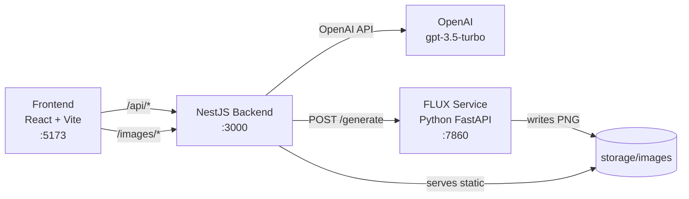

# AI Story Factory

AI Story Factory turns a short topic into a multi-scene short-video story pipeline: idea, narrative, script, character profile, video prompts, and scene images. Text generation runs through OpenAI; image generation runs through a local [FLUX](https://huggingface.co/black-forest-labs/FLUX.1-dev) service.

## Project structure

```
ai-story-factory/
└── apps/
    ├── backend/          NestJS API, LangGraph agents, OpenAI + FLUX integration
    │   ├── src/
    │   │   ├── agents/   Idea, story, script, character, prompt, image agents
    │   │   ├── graphs/   LangGraph content pipeline (idea → story → script)
    │   │   └── services/ OpenAI and FLUX HTTP clients
    │   ├── flux-service/ Python FastAPI service for FLUX image generation
    │   └── storage/images/ Generated scene images (gitignored except .gitkeep)
    └── frontend/         React + Vite UI
```

## Architecture



### Content pipeline

The UI runs these steps in order:

| Step | Agent | Output |
|------|-------|--------|
| 1. Idea | `IdeaAgent` | A viral short-video concept from a topic |
| 2. Story | `StoryAgent` | Full narrative from the idea |
| 3. Script | `ScriptAgent` | Scene-by-scene script (narration, visuals, duration) |
| 4. Character | `CharacterAgent` | Consistent character appearance description |
| 5. Video prompts | `PromptAgent` | FLUX-ready prompt per scene |
| 6. Images | `ImageAgent` | PNG image per scene via FLUX service |

A LangGraph workflow (`content.graph.ts`) also chains **idea → story → script** for programmatic use.

## Prerequisites

| Tool | Version | Used by |
|------|---------|---------|
| [Node.js](https://nodejs.org/) | 20+ recommended | Backend and frontend |
| [npm](https://www.npmjs.com/) | 10+ | Package installs |
| [Python](https://www.python.org/) | 3.10+ | FLUX service |
| [OpenAI API key](https://platform.openai.com/api-keys) | — | Text generation |
| [Hugging Face account](https://huggingface.co/) | — | FLUX model download (gated model) |
| NVIDIA GPU + driver | Optional but strongly recommended | FLUX image generation |

**GPU notes**

- FLUX.1-dev needs roughly **24 GB VRAM** if the full model is loaded on GPU.
- A **12 GB** GPU (e.g. RTX 4070) works with CPU offload (default in this project).
- Install **CUDA-enabled PyTorch**, not the CPU-only wheel from plain `pip install torch`.

## Local setup

Run all commands from the repository root unless noted otherwise.

### 1. Clone the repository

```bash
git clone <repository-url>
cd ai-story-factory
```

### 2. Backend (NestJS)

```bash
cd apps/backend
npm install
```

Create environment file:

```bash
cp .env.example .env
```

Edit `apps/backend/.env`:

```env
OPENAI_API_KEY=sk-...
FRONTEND_URL=http://localhost:5173
FLUX_SERVICE_URL=http://127.0.0.1:7860
# Optional. Defaults to apps/backend/storage/images
IMAGE_STORAGE_DIR=
# Optional. Defaults to 3000
PORT=3000
```

Start the API:

```bash
npm run start:dev
```

Backend runs at **http://localhost:3000**.

Other scripts:

```bash
npm run build        # Compile TypeScript
npm run start:prod   # Run compiled app
npm test             # Unit tests
npm run test:e2e     # End-to-end tests
```

### 3. FLUX image service (Python)

This service must be running before generating images.

```bash
cd apps/backend/flux-service
python -m venv .venv
```

**Windows (PowerShell)**

```powershell
.\.venv\Scripts\Activate.ps1
```

**macOS / Linux**

```bash
source .venv/bin/activate
```

Install PyTorch with CUDA (NVIDIA GPU):

```bash
# CUDA 13.0 — recommended if your driver supports it (580+ on Windows)
pip install torch --index-url https://download.pytorch.org/whl/cu130

# Older driver fallback
# pip install torch --index-url https://download.pytorch.org/whl/cu126
```

Install remaining dependencies:

```bash
pip install -r requirements.txt
```

Accept the FLUX model license on Hugging Face, then log in:

```bash
pip install huggingface_hub
huggingface-cli login
```

Visit [black-forest-labs/FLUX.1-dev](https://huggingface.co/black-forest-labs/FLUX.1-dev) and accept the license before the first run.

Start the service:

```bash
python server.py
```

Service runs at **http://127.0.0.1:7860**. First startup downloads the model and can take several minutes.

Verify:

```bash
curl http://127.0.0.1:7860/health
```

#### FLUX environment variables

| Variable | Default | Description |
|----------|---------|-------------|
| `FLUX_MODEL_ID` | `black-forest-labs/FLUX.1-dev` | Hugging Face model id |
| `FLUX_HOST` | `127.0.0.1` | Bind address |
| `FLUX_PORT` | `7860` | Bind port |
| `FLUX_INFERENCE_STEPS` | `28` | Diffusion steps (`4` for FLUX.1-schnell) |
| `FLUX_GUIDANCE_SCALE` | `3.5` | Guidance scale (`0` for schnell) |
| `FLUX_IMAGE_WIDTH` | `576` | Output width |
| `FLUX_IMAGE_HEIGHT` | `1024` | Output height |
| `FLUX_OFFLOAD_MODE` | `sequential` | GPU memory mode: `sequential`, `model`, or `full` |
| `IMAGE_STORAGE_DIR` | `../storage/images` | Where PNG files are saved |

**Lighter model for faster generation (optional)**

```powershell
$env:FLUX_MODEL_ID="black-forest-labs/FLUX.1-schnell"
$env:FLUX_INFERENCE_STEPS="4"
$env:FLUX_GUIDANCE_SCALE="0"
python server.py
```

From the backend folder you can also run:

```bash
npm run flux:dev
```

(requires the Python venv activated and `python` on your PATH)

### 4. Frontend (React + Vite)

```bash
cd apps/frontend
npm install
```

Optional `.env` (defaults work in local dev):

```bash
cp .env.example .env
```

```env
# Optional. Dev default proxies /api to http://localhost:3000
VITE_API_URL=
```

Start the dev server:

```bash
npm run dev
```

Frontend runs at **http://localhost:5173**.

Vite proxies:

- `/api/*` → `http://localhost:3000/*`
- `/images/*` → `http://localhost:3000/images/*`

Build for production:

```bash
npm run build
npm run preview
```

## Running everything locally

Open **three terminals**:

| Terminal | Directory | Command |
|----------|-----------|---------|
| 1 | `apps/backend/flux-service` | `python server.py` |
| 2 | `apps/backend` | `npm run start:dev` |
| 3 | `apps/frontend` | `npm run dev` |

Then open **http://localhost:5173**, enter a topic, and run the pipeline.

## API reference

Base URL: `http://localhost:3000`

| Method | Path | Body | Response |
|--------|------|------|----------|
| `GET` | `/` | — | Health/hello string |
| `POST` | `/generate/idea` | `{ "topic": "..." }` | `{ "idea": "..." }` |
| `POST` | `/generate/story` | `{ "idea": "..." }` | `{ "story": "..." }` |
| `POST` | `/generate/script` | `{ "story": "..." }` | `{ "script": SceneScript[] }` |
| `POST` | `/generate/character/profile` | `{ "story", "script" }` | `{ "characterAppearance": "..." }` |
| `POST` | `/generate/prompt` | `{ "scene", "characterAppearance" }` | `{ "scene": SceneScript }` |
| `POST` | `/generate/image` | `{ "scene": SceneScript }` | `{ "scene": SceneScript }` |
| `GET` | `/images/:filename` | — | Generated PNG |

`SceneScript` fields: `sceneNumber`, `narration`, `visualDescription`, `duration`, and optional `videoPrompt`, `characterAppearance`, `imagePath`.

FLUX service (direct):

| Method | Path | Body |
|--------|------|------|
| `GET` | `/health` | — |
| `POST` | `/generate` | `{ "prompt": "...", "scene_number": 1 }` |

## Tech stack

| Layer | Technologies |
|-------|----------------|
| Frontend | React 19, TypeScript, Vite |
| Backend | NestJS 11, TypeScript |
| AI orchestration | LangGraph, LangChain, OpenAI SDK |
| Text model | OpenAI `gpt-3.5-turbo` |
| Image model | FLUX.1-dev via Diffusers |
| Image service | Python, FastAPI, Uvicorn, PyTorch, Diffusers |

## Troubleshooting

### `device=cpu` despite having an NVIDIA GPU

Plain `pip install torch` installs the **CPU-only** build. Reinstall with a CUDA index:

```bash
pip install torch --upgrade --index-url https://download.pytorch.org/whl/cu130
```

Stop the FLUX server before upgrading (Windows locks DLLs during install).

Verify:

```bash
python -c "import torch; print(torch.__version__); print(torch.cuda.is_available())"
```

### `CUDA out of memory`

FLUX.1-dev is large. Defaults use `FLUX_OFFLOAD_MODE=sequential` for ~12 GB GPUs. If it still fails:

- Lower resolution: `FLUX_IMAGE_WIDTH=512`, `FLUX_IMAGE_HEIGHT=768`
- Fewer steps: `FLUX_INFERENCE_STEPS=20`
- Use `FLUX.1-schnell` (see above)
- Close other GPU-heavy apps

### `enable_model_cpu_offload requires accelerator`

CPU offload needs a GPU. On CPU-only machines the service runs fully on CPU (very slow, high RAM). Install CUDA PyTorch if you have a GPU.

### Image generation fails from the UI

1. Confirm FLUX service is up: `curl http://127.0.0.1:7860/health`
2. Confirm `FLUX_SERVICE_URL` in backend `.env` matches
3. Confirm Hugging Face login and FLUX license acceptance
4. Check the FLUX terminal for Python errors

### CORS errors

Set `FRONTEND_URL` in `apps/backend/.env` to match where the UI is served (default `http://localhost:5173`).

### OpenAI errors

Ensure `OPENAI_API_KEY` is set in `apps/backend/.env` and the key is valid with billing enabled.

## Storage

Generated images are written to `apps/backend/storage/images/` and served by the NestJS backend at `/images/<filename>`. Image files are gitignored; only `.gitkeep` is tracked.
